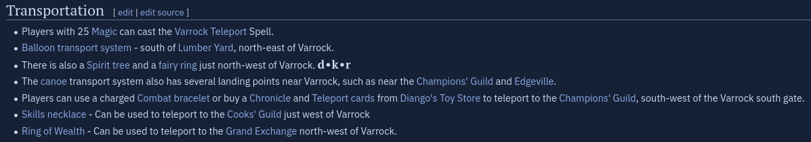

# Transportation
Getting around in the early game if fucking brutal. Let's talk about some of the ways you can travel.

> While using RuneLite, open your World Map. All modes of transportation can be found with icons telling you how to get there.

## Using the wiki
The OSRS wiki is an amazing resource you will use regularly. Most locations have a "getting there" or "transportation" section, detailing different ways to get to your destination.

|                Example getting there section                 |
| :----------------------------------------------------------: |
|  |

---

## Running
Using your energy to run is the main way you will get around. Your energy level depletes faster with the more weight you carry, so be mindful. A higher Agility level really helps your run energy and unlocked the **Graceful Outfit**, a set of armour that reduces your weight.

## Boats
Charter boats are a cheap and easy way to get around to coastal cities.

## Magic
Magic is used for many things, including travel. Teleport to Varrock, for example, is unlocked at level 25 Magic. *But that doesn't mean you need 25 magic to use it!* Many of the most common teleports are available in tablet (item) form. So you can go the GE and buy Varrock teleport tablets.

## Enchanted Jewelry
Enchanted jewelry is another buyable way to get around the game. Items like the skilling necklace, necklace of passage, ring of dueling, and more can be bought cheaply and used to teleport around. Learning which items teles you where can be overwhelming, but it comes with time.

## Spirit Trees
After the [Tree Gnome Village Quest](https://oldschool.runescape.wiki/w/Tree_Gnome_Village), you unlock a handful of [Spirit Trees](https://oldschool.runescape.wiki/w/Spirit_tree) around the game. You simply click on a tree and select another you'd like to travel to.

## Fairy Rings
After *starting* [Fairytale II](https://oldschool.runescape.wiki/w/Fairytale_II_-_Cure_a_Queen), you unlock the most powerful transportation network, the Fairy Rings. Each Fairy Ring has a 3 letter code ID used to travel between rings.

## Hot Air Balloons
Are literally stupid. I hate them. They're locked behind a quest and a really frustrating minigame, and require burning particularly logs to get to the different spots. It's ass-shit. Next!

## The grouping tab
The last method is the grouping tab. Games where players congregate typically have a **Group Teleport** option, which you can use every 20 minutes.

[A more detailed look can be found here](https://oldschool.runescape.wiki/w/Transportation)