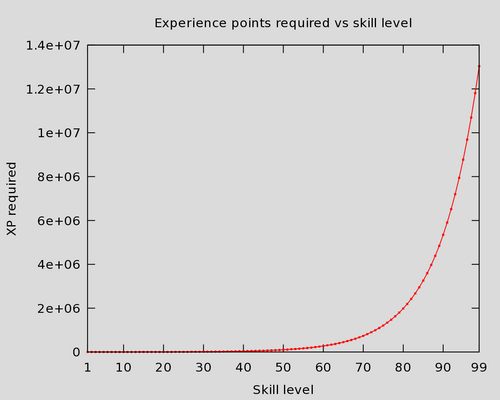

# Experience
Not a lot to say here, it's pretty easy to understand.

What's not easy to understand, is how the halfway point to level 99 is actually level ~91.

The experience required between levels grows at an astonishing rate. Below is the difference between levels, graphed linearly.

|                      😅                       |
| :------------------------------------------: |
|  |

What makes questing OP is that you get lumps of XP that hurdle you through the early game.

[You can check out the table here](https://oldschool.runescape.wiki/w/Experience#Experience_table)